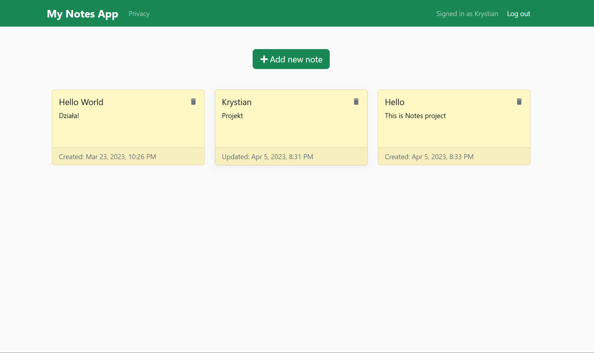

<br />
<div align="center">
  <h1 style="margin-bottom: 50px">My Notes App </h1>
 
</div>

<details>
  <summary>Table of Contents</summary>
  <ol>
    <li>
      <a href="#about-the-project">About The Project</a>
      <ul>
        <li><a href="#how-app-work">Video How App Work</a></li>
        <li><a href="#built-with">Built With</a></li>
      </ul>
    </li>
    <li>
      <a href="#getting-started">Getting Started</a>
      <ul>
        <li><a href="#prerequisites">Prerequisites</a></li>
        <li><a href="#installation">Installation</a></li>
      </ul>
    </li>
    <li><a href="#roadmap">Roadmap</a></li>
    <li><a href="#contact">Contact</a></li>
  </ol>
</details>


## About The Project

My Notes App is my first big project and important for me. In the project I used the acquired knowledge and put it together in this project.

Using My Notes App, we can easily add and quickly edit/delete our notes.

We set up our own account so that our notes are always available to us.

The application is fully responsive so we can use it on a phone or laptop.

<p align="right">(<a href="#readme-top">back to top</a>)</p>

### Video How App Work

<p align="right">(<a href="#readme-top">back to top</a>)</p>


### Built With

<p align="center">
  <a href="https://skillicons.dev">
    
  </a>
</p>

<p align="right">(<a href="#readme-top">back to top</a>)</p>


## Getting Started

To run this project, install it locally using npm.

### Prerequisites

Install the latest version of npm in your runtime.
* npm
  ```sh
  npm install npm@latest -g
  ```

### Installation


1. Clone the repo
   ```sh
   git clone https://github.com/krystian2077/notes-app-backend.git
   ```
3. Install NPM packages
   ```sh
   npm install
   ```
4. Run npm script
   ```sh
   npm nodemon start src/server.ts;
   ```

<p align="right">(<a href="#readme-top">back to top</a>)</p>

## Roadmap

- [x] Add responsive view
- [x] Add authentication
- [ ] Add dark/light mode
- [ ] Add search field for notes

<p align="right">(<a href="#readme-top">back to top</a>)</p>


<!-- CONTACT -->
## Contact

Email: krystian.potaczek07@gmail.com

My phone number: 788-986-074


<p align="right">(<a href="#readme-top">back to top</a>)</p>
